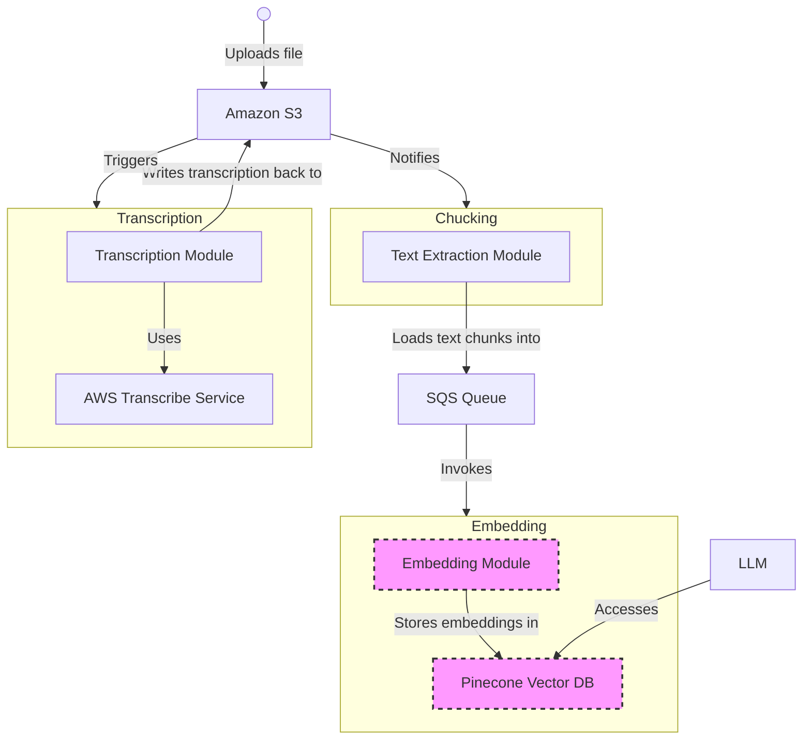

# Video Pipeline

A serverless audio/video processing pipeline designed to automate transcription and semantic chunking of media content. This pipeline is part of the InfoQ Certified Architect in Emerging Technologies (ICAET) certification at QCon London.

## Project Overview

This project implements a modern serverless architecture for processing audio and video files, featuring:

- Automatic transcription of audio/video files using AWS Transcribe
- Semantic chunking of transcriptions for improved content organization
- Event-driven architecture using EventBridge and Step Functions
- Infrastructure as Code using Terraform
- Comprehensive testing suite including unit, integration, and end-to-end tests

## Architecture

The video processing pipeline leverages AWS services in a serverless architecture pattern:

### Core Components

1. **Storage Layer**
   - S3 buckets for input media files
   - Separate buckets for transcription and chunking outputs
   - Secure and scalable storage with versioning

2. **Event Processing**
   - CloudTrail for capturing S3 object creation events
   - EventBridge for event routing and management
   - Step Functions for workflow orchestration

3. **Processing Modules**
   - Transcribe Module: Handles audio/video transcription
   - Chunking Module: Processes transcriptions into semantic chunks
   - Lambda functions for serverless execution

### Workflow Diagram

The above Mermaid diagram illustrates the complete workflow from file upload to final processing.

## Project Structure

```
video-pipeline/
├── infra/                  # Infrastructure as Code
│   ├── bootstrap/         # Initial setup resources
│   ├── environments/      # Environment configurations
│   ├── modules/          # Reusable Terraform modules
│   └── build/            # Build artifacts
│
├── modules/               # Service Implementations
│   ├── transcribe-module/ # Audio/video transcription service
│   └── chunking-module/   # Semantic chunking service
│
├── tests/                 # Test Suite
│   ├── unit/             # Unit tests
│   ├── integration/      # Integration tests
│   └── e2e/              # End-to-end tests
│
├── samples/              # Sample media files
├── events/              # Sample event payloads
├── specs/               # API specifications
└── .vscode/            # VS Code configurations
```

## Prerequisites

- AWS Account with appropriate permissions
- AWS CLI configured with credentials
- Python 3.9 or higher
- Terraform 1.0 or higher
- Docker (for local testing)
- Make (optional, for build scripts)

## Getting Started

### Local Development Setup

1. Clone and setup the repository:
   ```bash
   git clone <repository-url>
   cd video-pipeline
   python -m venv .venv
   source .venv/bin/activate  # On Windows: .venv\Scripts\activate
   pip install -r requirements.txt
   pip install -r dev-requirements.txt
   ```

2. Configure AWS credentials:
   ```bash
   aws configure
   # Follow prompts to input your AWS credentials
   ```

### Deployment

1. Build the modules:
   ```bash
   # Clean and create build directory
   rm -rf ./infra/build
   mkdir -p ./infra/build
   
   # Package Lambda functions
   zip -r ./infra/build/transcribe-module.zip ./modules/transcribe-module
   zip -r ./infra/build/chunking-module.zip ./modules/chunking-module
   ```

2. Deploy infrastructure:
   ```bash
   cd infra/environments/dev
   terraform init
   terraform plan -out=tfplan
   terraform apply tfplan
   ```

3. Verify deployment:
   ```bash
   terraform output
   aws stepfunctions list-state-machines
   ```

## Testing

### Running Tests

1. Unit Tests:
   ```bash
   python -m pytest tests/unit -v
   ```

2. Integration Tests:
   ```bash
   python -m pytest tests/integration -v
   ```

3. End-to-End Tests:
   ```bash
   cd tests/e2e
   ./run_e2e_test.sh --cleanup
   ```

### Test Options

- `--cleanup`: Remove test artifacts after completion
- `--file PATH`: Use custom sample file
- `--timeout SECONDS`: Custom timeout (default: 300s)
- `--input-bucket BUCKET`: Specify input bucket
- `--output-bucket BUCKET`: Specify output bucket

## Contributing

1. Fork the repository
2. Create a feature branch (`git checkout -b feature/amazing-feature`)
3. Commit changes (`git commit -m 'Add amazing feature'`)
4. Push to branch (`git push origin feature/amazing-feature`)
5. Open a Pull Request

## License

This project is licensed under the Apache License 2.0 - see the [LICENSE](LICENSE) file for details.

## Contact

Wesley Reisz