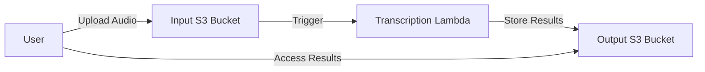

# Video Pipeline

A serverless audio/video processing pipeline designed to automate transcription and other media processing. This pipeline will be used as part of the InfoQ Certified Architect in Emerging Technologies (ICAET) certification at QCon London. 

## Project Overview

This project implements a serverless architecture for processing audio and video files. The core functionality includes:

- Automatic transcription of audio files
- Scalable infrastructure using AWS services
- Modular design for easy extension with additional processing capabilities

## Architecture

The solution uses AWS Serverless Application Model (SAM) with Lambda functions triggered by S3 events:

1. Video/Audio files uploaded to an input S3 bucket
2. Lambda function triggers to process the files
3. Processing results stored in an output S3 bucket



## Project Structure

- **infra/**: Infrastructure as code
  - `modules/`: Reusable infrastructure modules
  - `environments/`: Environment-specific configurations

- **modules/**: Individual service implementations
  - `transcribe-module/`: Service for transcribing audio files

- **libs/**: Shared libraries and code
  - `base/`: Base libraries used across projects

- **samples/**: Sample media files for testing

- **Configuration files:**
  - `pip-requirements.txt`: Python dependencies
  - `dev-requirements.txt`: Development-specific Python dependencies
  - `template.yaml`: SAM template for AWS resources
  - `docker-compose.yml`: Local development environment

## Prerequisites

- Python 3.9+
- AWS CLI
- AWS SAM CLI
- Docker (for local testing)

## Getting Started

### Installation

1. Clone the repository
   ```
   git clone <repository-url>
   cd video-pipeline
   ```

2. Set up a Python virtual environment
   ```
   python -m venv venv
   source venv/bin/activate  # On Windows: venv\Scripts\activate
   ```

3. Install dependencies
   ```
   pip install -r requirements.txt
   pip install -r dev-requirements.txt  # For development
   ```

### Local Development

Use Docker Compose to set up the local environment:

```
docker-compose up
```

### Deployment

To deploy the complete application, follow these steps:

1. Build the application
   ```
   # Clean the build directory if it exists
   rm -rf ./infra/build
   
   # Create a new build directory
   mkdir -p ./infra/build
   
   # Package the Lambda function code
   zip -r ./infra/build/transcribe-module.zip ./modules/transcribe-module
   ```

2. Deploy infrastructure using Terraform
   ```
   # Navigate to the desired environment directory
   cd infra/environments/dev
   
   # Initialize Terraform
   terraform init
   
   # Plan the deployment to see what will change
   terraform plan -out=tfplan
   
   # Apply the changes
   terraform apply tfplan
   ```

3. Verify deployment
   ```
   # List the created resources
   terraform output
   ```

4. To destroy the infrastructure when no longer needed
   ```
   terraform destroy
   ```

## Testing

Run tests using pytest:

```
pytest
```

## Contributing

1. Fork the repository
2. Create a feature branch (`git checkout -b feature/amazing-feature`)
3. Commit your changes (`git commit -m 'Add some amazing feature'`)
4. Push to the branch (`git push origin feature/amazing-feature`)
5. Open a Pull Request

## License

This project is licensed under the Apache License 2.0 - see the [LICENSE](LICENSE) file for details.

## Contact

Wesley Reisz