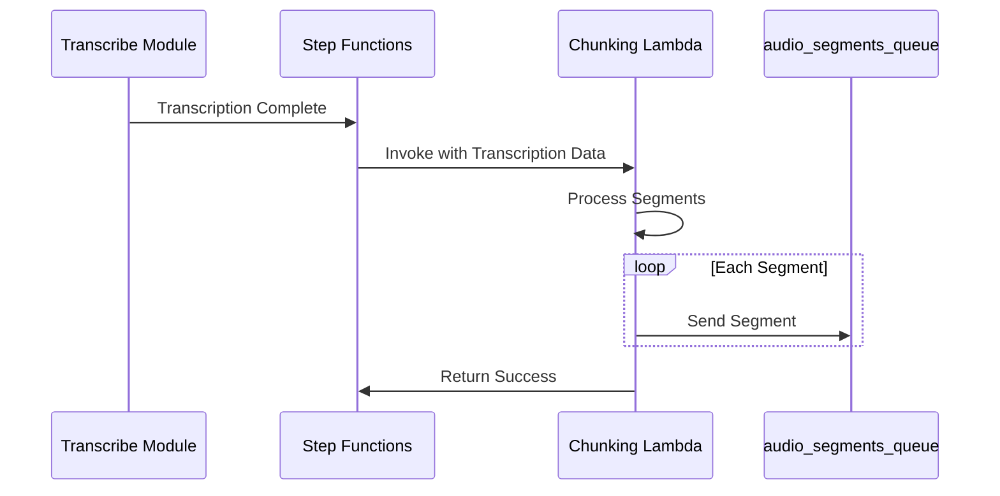

# Media Chunking Module

This module is part of the video pipeline project and handles chunking of transcribed media files into segments using AWS Lambda, Step Functions, and SQS.

## Overview

The chunking module processes transcription results and segments them into manageable chunks for further processing. Here's how it works:

1. Receives transcription results from the transcribe-module via Step Functions
2. Processes the transcription into logical segments
3. Sends each segment to an SQS queue (`audio_segments_queue`) for further processing

### Flow Diagram



## Getting Started

### Prerequisites

- AWS CLI configured with appropriate credentials
- Terraform >= 5.91.0 (required)
- Python 3.9+
- Docker (for local testing with LocalStack)

### Deployment

#### Option 1: Using the Automated Deployment Script (Recommended)

The project includes an automated deployment script that handles all the steps required to build, test, and deploy the module to the dev environment:

```bash
# Navigate to the dev environment directory
cd infra/environments/dev

# Format and validate Terraform code
terraform fmt
terraform validate

# Run the deployment script
./deploy.sh
```

#### Option 2: Manual Deployment

If you prefer to deploy manually, follow these steps:

1. Set up the module-specific virtual environment:
   ```bash
   cd modules/chunking-module
   python -m venv .venv
   source .venv/bin/activate  # On Windows: .venv\Scripts\activate
   ```

2. Install dependencies:
   ```bash
   # For production/runtime dependencies only
   pip install -r requirements.txt
   
   # For development, testing, and code quality tools
   pip install -r dev-requirements.txt
   ```

3. Run tests to validate the code:
   ```bash
   python -m pytest -xvs tests/
   ```

4. Build the Lambda deployment package:
   ```bash
   mkdir -p ../../infra/build
   cd ../..
   zip -r infra/build/chunking_lambda.zip modules/chunking-module/src/
   ```

5. Deploy to the dev environment:
   ```bash
   cd infra/environments/dev
   # Format and validate Terraform code
   terraform fmt
   terraform validate
   # Plan and apply changes
   terraform init
   terraform plan -out=tfplan
   terraform apply "tfplan"
   ```

## Project Structure

- `src/`: Lambda function code
  - `handlers/`: Lambda entry points
  - `services/`: Business logic for chunking
  - `models/`: Data structures
  - `utils/`: Helper functions and utilities
- `tests/`: Unit tests
- `specs/`: Design documents and specifications

## Testing

### Running Tests

The chunking module has comprehensive test coverage including unit tests and integration tests. Here's how to run them:

1. **Setup Test Environment**:
   ```bash
   cd modules/chunking-module
   # Activate virtual environment
   source .venv/bin/activate  # On Windows: .venv\Scripts\activate
   # Install test dependencies
   pip install -r dev-requirements.txt
   ```

2. **Run All Tests with Coverage**:
   ```bash
   # Run all tests with coverage report
   python -m pytest tests/ -v --cov=src.handlers
   ```

3. **Run Specific Test Types**:
   ```bash
   # Run only unit tests
   python -m pytest tests/unit/ -v

   # Run only integration tests
   python -m pytest tests/integration/ -v
   ```

### Test Coverage Requirements

The project maintains a minimum of 90% test coverage requirement. To check coverage:

```bash
# Run tests with detailed coverage report
python -m pytest tests/ --cov=src.handlers --cov-report=term-missing
```

If coverage falls below 90%, the deployment script will fail with an error message.

### Test Structure

- `tests/unit/`: Unit tests for individual components
  - `test_chunking_handler.py`: Tests for the main handler functions
  - Tests for extract_s3_details, process_audio_segments, etc.

- `tests/integration/`: Integration tests
  - `test_chunking_integration.py`: End-to-end flow tests
  - Tests for S3 to SQS processing pipeline

### Test Fixtures

The test suite includes fixtures for:
- Mock AWS services (S3, SQS)
- Sample transcription data
- Environment variables
- AWS credentials

### Monitoring Test Results

When running tests, you'll see:
- Detailed test execution output
- Coverage statistics
- Failed test descriptions
- Missing coverage lines

### Debugging Failed Tests

If tests fail, check:
1. Environment variables are set correctly
2. Virtual environment is activated
3. All dependencies are installed
4. AWS credentials are configured
5. Log output in the test results

### Continuous Integration

Tests are automatically run:
- Before each deployment (via deploy.sh)
- In the CI/CD pipeline
- When creating pull requests

### Monitoring SQS Queue

To view messages in the SQS queue:

```bash
# View messages in the queue (up to 10 messages)
aws sqs receive-message \
    --queue-url https://sqs.us-east-1.amazonaws.com/855007292085/audio_segments_queue \
    --max-number-of-messages 10

# Get queue attributes (message count, etc.)
aws sqs get-queue-attributes \
    --queue-url https://sqs.us-east-1.amazonaws.com/855007292085/audio_segments_queue \
    --attribute-names All
```

Example message format:
```json
{
    "id": 0,
    "transcript": "Hello, my name is Wes.",
    "start_time": "0.0",
    "end_time": "1.57",
    "items": [0, 1, 2, 3, 4, 5, 6]
}
```

## Environment Variables

The Lambda function uses the following environment variables:

- `SQS_QUEUE_URL`: The URL of the SQS queue where segments are sent

## Security Best Practices

Following project standards, this module:
- Uses IAM roles with least privilege access
- Stores sensitive values in AWS Secrets Manager
- Enables encryption for SQS messages
- Regularly audits IAM permissions
- Uses security groups to restrict access

## Contributing

1. Follow the project's Terraform standards:
   - Use snake_case for all resource names
   - Prefix resources with purpose or component
   - Include environment in resource names
   - Run `terraform fmt` before committing
   - Use 2-space indentation
   - Keep resource blocks concise and focused

2. Ensure all tests pass before submitting pull requests

3. Always use the deploy.sh script to verify changes in the dev environment 