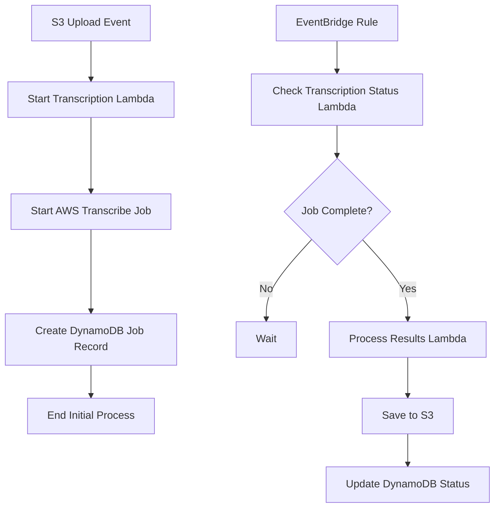

# Asynchronous Transcription Processing

## Context
Currently, the transcription process is handled synchronously within a Lambda function that has a 60-second timeout. This creates issues with larger files or when transcription takes longer than the timeout period. We need to modify the architecture to handle transcriptions asynchronously.

## Proposed Changes

### 1. Step Functions Workflow Modification

Update the Step Functions workflow to separate the transcription initiation from the result processing:



### 2. Infrastructure Changes

1. Create a DynamoDB table for tracking transcription jobs:
   ```hcl
   resource "aws_dynamodb_table" "transcription_jobs" {
     name           = "dev_transcription_jobs"
     billing_mode   = "PAY_PER_REQUEST"
     hash_key       = "job_id"
     
     attribute {
       name = "job_id"
       type = "S"
     }
     
     attribute {
       name = "status"
       type = "S"
     }
     
     global_secondary_index {
       name               = "status-index"
       hash_key          = "status"
       projection_type    = "ALL"
     }
   }
   ```

2. Create an EventBridge rule to periodically check job status:
   ```hcl
   resource "aws_cloudwatch_event_rule" "check_transcription_status" {
     name                = "check-transcription-status"
     description         = "Periodically check transcription job status"
     schedule_expression = "rate(1 minute)"
   }
   ```

### 3. Lambda Function Changes

1. Split the current transcription Lambda into three functions:
   - `start_transcription`: Initiates the transcription job and creates DynamoDB record
   - `check_transcription_status`: Polls AWS Transcribe for job status
   - `process_transcription_results`: Handles completed transcriptions

2. Update IAM roles with necessary permissions for DynamoDB and EventBridge

### 4. Error Handling

1. Implement retry logic with exponential backoff
2. Add dead-letter queues for failed jobs
3. Create CloudWatch alarms for monitoring job status
4. Implement job cleanup for completed/failed transcriptions

## Implementation Steps

1. Create new Terraform configurations for:
   - DynamoDB table
   - EventBridge rules
   - Additional Lambda functions
   - Updated IAM roles

2. Develop new Lambda functions:
   ```python
   # start_transcription.py
   def handler(event, context):
       job_id = start_aws_transcribe_job()
       create_dynamodb_record(job_id)
       return {"job_id": job_id}

   # check_transcription_status.py
   def handler(event, context):
       incomplete_jobs = query_dynamodb_for_incomplete_jobs()
       for job in incomplete_jobs:
           check_and_update_status(job)

   # process_transcription_results.py
   def handler(event, context):
       process_completed_job(event['job_id'])
       update_job_status(event['job_id'], 'COMPLETED')
   ```

3. Update Step Functions state machine definition

4. Add monitoring and alerting:
   - CloudWatch metrics for job duration
   - Alerts for failed jobs
   - Dashboard for job status

## Testing

1. Create unit tests for each new Lambda function
2. Add integration tests for the complete workflow
3. Test with various file sizes:
   - Small files (< 1MB)
   - Medium files (1-10MB)
   - Large files (> 10MB)

## Rollout Plan

1. Deploy infrastructure changes
2. Deploy new Lambda functions
3. Update Step Functions state machine
4. Run test suite
5. Monitor initial jobs
6. Remove old synchronous implementation

## Success Criteria

1. Successfully process files larger than 10MB
2. No Lambda timeouts
3. All jobs tracked in DynamoDB
4. Failed jobs properly handled and reported
5. Average job processing time within SLA
6. Monitoring and alerting in place

## Rollback Plan

1. Revert Step Functions to previous version
2. Remove new Lambda functions
3. Remove DynamoDB table
4. Remove EventBridge rules 